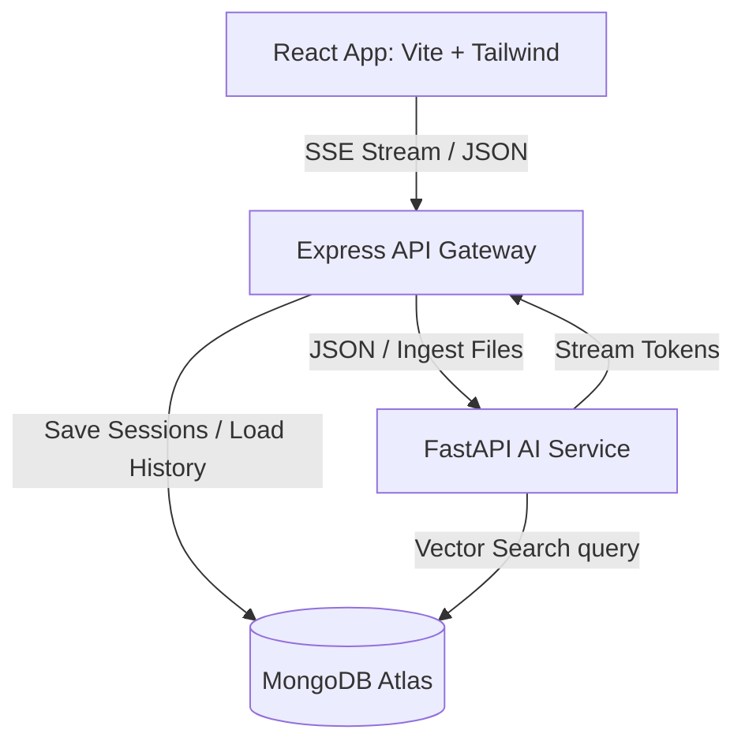

# AI-Powered Support Agent Monorepo

A proof-of-concept AI-powered customer support agent built as a monorepo using **Turborepo**. The application uses Retrieval-Augmented Generation (RAG) to query ingested company manuals and stream accurate, hallucination-free answers to support agents.

## 🏗 Architecture & Design



1. **Frontend (React)**: Beautiful UI with support for markdown rendering, upload modal, visual citations, and server-sent event (SSE) word-by-word streaming.
2. **API Gateway (Express)**: Manages chat sessions, persists conversation history to MongoDB, handles incoming document uploads, and acts as a streaming proxy to the frontend.
3. **AI Microservice (FastAPI)**: Handles heavy-lifting AI tasks like generating chunk embeddings, performing Atlas Vector Search, system prompting (hallucination limits), and LLM text generation (OpenAI).

---

## 🛠 Local Setup

### Prerequisite: MongoDB Atlas Vector Search Index
1. Create a MongoDB Atlas cluster (free tier works great).
2. Create database `support_agent` and collection `document_chunks`.
3. Create a **Vector Search Index** on the `document_chunks` collection:
   - Index Name: `vector_index`
   - Definition:
     ```json
     {
       "fields": [
         {
           "type": "vector",
           "path": "embedding",
           "numDimensions": 768,
           "similarity": "cosine"
         }
       ]
     }
     ```
     *(Note: If using OpenAI embeddings, set `numDimensions` to `1536`. For Google Gemini, set it to `768`)*.

---

### Method A: Setup using Docker Compose (Recommended)
1. Copy `.env.example` to `.env`:
   ```bash
   cp .env.example .env
   ```
2. Populate the `.env` with your `MONGODB_URI` and `OPENAI_API_KEY`.
3. Spin up all services:
   ```bash
   docker-compose up --build
   ```
4. Access the frontend at: `http://localhost:3000`.

---

### Method B: Manual Local Development
1. **Install Root Monorepo dependencies**:
   ```bash
   pnpm install
   ```
2. **Configure Environment Variables**:
   - Create a `.env` in `apps/express-gateway` and add `MONGODB_URI` and `FASTAPI_SERVICE_URL=http://localhost:8000`.
   - Create a `.env` in `apps/fastapi-service` and add `MONGODB_URI` and `OPENAI_API_KEY`.
   - Create a `.env` in `apps/web` and add `VITE_API_URL=http://localhost:5000`.
3. **Run Dev server**:
   ```bash
   pnpm dev
   ```

---

## 🚀 Deploying to Vercel

Since this is a Turborepo monorepo, you can deploy each application as a separate Vercel Project linked to the same Git repository:

1. **Frontend (`apps/web`)**:
   - Framework Preset: `Vite`
   - Root Directory: `apps/web`
   - Environmental Variable: Set `VITE_API_URL` to your deployed Express Gateway URL.

2. **Express Gateway (`apps/express-gateway`)**:
   - Framework Preset: `Other` (Vercel automatically picks up `vercel.json`)
   - Root Directory: `apps/express-gateway`
   - Environmental Variables: Set `MONGODB_URI` and `FASTAPI_SERVICE_URL` (points to your deployed Python FastAPI service).

3. **FastAPI Service (`apps/fastapi-service`)**:
   - Framework Preset: `Other` (Vercel automatically picks up `vercel.json` and runs Python Serverless Function compiler)
   - Root Directory: `apps/fastapi-service`
   - Environmental Variables: Set `MONGODB_URI` and LLM keys.
